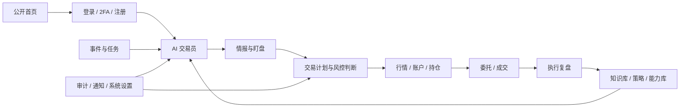
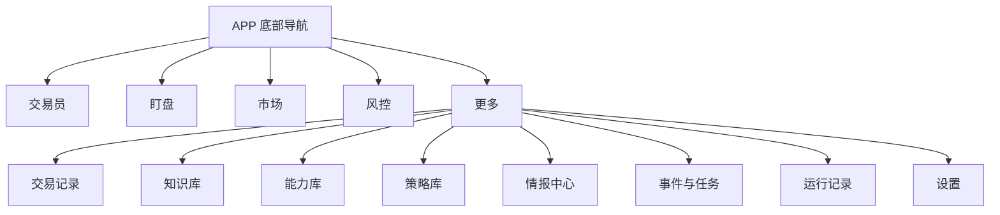

# KORDYN APP / 桌面端全界面检查包

生成日期：2026-09-04  
界面来源：当前工作区的 KORDYN `August15` 实现（包含生成时尚未提交的本地改动）  
截图规格：桌面端 `1440 × 900`；APP `390 × 844`  
数据说明：使用脱敏的、接近真实结构的演示数据；未连接真实账户，也未执行会改变账户状态的操作。

## 1. 包内内容

- `screenshots/desktop/`：45 张桌面端主界面。
- `screenshots/app/`：45 张 APP 主界面，与桌面端使用相同编号，便于逐张对照。
- `screenshots/auth/`：7 张公开首页、登录、2FA、注册及注册关闭状态。
- `screenshots/overlays/`：38 张子界面；桌面端 19 张、APP 19 张，包含弹窗、抽屉、详情面板和确认框。
- `contact-sheets/`：5 张总览拼图，用于先快速扫描，再打开原尺寸截图。
- `desktop-inventory.json`、`app-inventory.json`、`auth-inventory.json`、`overlay-inventory.json`：机器可读清单。
- `manifest.json`：文件尺寸、像素尺寸及 SHA-256 校验值。
- `CHATGPT_REVIEW_PROMPT_ZH.md`：可以直接复制给 ChatGPT 的中文审查要求。

合计：**135 张原始截图 + 5 张总览拼图**。

## 2. 建议阅读顺序

1. 先看 `contact-sheets/03-auth-all.jpg`，理解公开入口和登录/注册流程。
2. 看 `contact-sheets/01-desktop-all.jpg`，按 01–45 建立完整信息架构。
3. 看 `contact-sheets/02-app-all.jpg`，用相同编号与桌面端逐张比较。
4. 看 `contact-sheets/04-desktop-overlays.jpg` 和 `05-app-overlays.jpg`，检查弹窗、抽屉、详情和危险操作确认。
5. 对发现的问题打开 `screenshots/` 中对应的原尺寸 PNG；不要只依据总览拼图判断字号或间距。

主界面编号分组：

- 01–05：AI 交易员
- 06–16：交易、账户、持仓、订单、成交与复盘
- 17–23：研究、知识、策略与能力
- 24–28：风险与安全
- 29–33：事件、任务、审计与通知
- 34–45：系统设置

## 3. 产品流程与页面关联

桌面端通过左侧完整导航进入各模块。APP 使用渐进式导航：

## 4. 45 个主界面的逐张映射

桌面端与 APP 的同编号截图表达同一个产品路由；如果移动端进行了合并、重定向或降级显示，也仍保留原路由编号，便于发现差异。

| 编号 | 分组 | 页面 | 路径 | 桌面端 | APP |
|---:|---|---|---|---|---|
| 01 | AI | AI 交易员 / 对话 | `/app/ai/dialog` | [PNG](screenshots/desktop/01-ai-dialog.png) | [PNG](screenshots/app/01-ai-dialog.png) |
| 02 | AI | AI 交易员 / 自主巡检入口 | `/app/ai/patrol` | [PNG](screenshots/desktop/02-ai-patrol.png) | [PNG](screenshots/app/02-ai-patrol.png) |
| 03 | AI | AI 交易员 / 海报入口 | `/app/ai/poster` | [PNG](screenshots/desktop/03-ai-poster.png) | [PNG](screenshots/app/03-ai-poster.png) |
| 04 | AI | AI 交易员 / 情报 | `/app/ai/intelligence` | [PNG](screenshots/desktop/04-ai-intelligence.png) | [PNG](screenshots/app/04-ai-intelligence.png) |
| 05 | AI | AI 交易员 / 盯盘 | `/app/ai/watch` | [PNG](screenshots/desktop/05-ai-watch.png) | [PNG](screenshots/app/05-ai-watch.png) |
| 06 | 交易 | 交易驾驶舱 / 总览 | `/app/trade/overview` | [PNG](screenshots/desktop/06-trade-overview.png) | [PNG](screenshots/app/06-trade-overview.png) |
| 07 | 交易 | 交易驾驶舱 / 行情 | `/app/trade/market` | [PNG](screenshots/desktop/07-trade-market.png) | [PNG](screenshots/app/07-trade-market.png) |
| 08 | 交易 | 交易驾驶舱 / 账户入口 | `/app/trade/account` | [PNG](screenshots/desktop/08-trade-account.png) | [PNG](screenshots/app/08-trade-account.png) |
| 09 | 交易 | 交易驾驶舱 / 持仓 | `/app/trade/positions` | [PNG](screenshots/desktop/09-trade-positions.png) | [PNG](screenshots/app/09-trade-positions.png) |
| 10 | 交易 | 交易驾驶舱 / 保护入口 | `/app/trade/protection` | [PNG](screenshots/desktop/10-trade-protection.png) | [PNG](screenshots/app/10-trade-protection.png) |
| 11 | 交易 | 交易驾驶舱 / 执行与复盘 | `/app/trade/execution-review` | [PNG](screenshots/desktop/11-trade-execution-review.png) | [PNG](screenshots/app/11-trade-execution-review.png) |
| 12 | 交易 | 交易驾驶舱 / 委托与成交 | `/app/trade/orders-fills` | [PNG](screenshots/desktop/12-trade-orders-fills.png) | [PNG](screenshots/app/12-trade-orders-fills.png) |
| 13 | 交易 | 交易驾驶舱 / 委托入口 | `/app/trade/orders` | [PNG](screenshots/desktop/13-trade-orders.png) | [PNG](screenshots/app/13-trade-orders.png) |
| 14 | 交易 | 交易驾驶舱 / 成交入口 | `/app/trade/fills` | [PNG](screenshots/desktop/14-trade-fills.png) | [PNG](screenshots/app/14-trade-fills.png) |
| 15 | 交易 | 交易复盘 / 列表 | `/app/trade/reviews` | [PNG](screenshots/desktop/15-trade-reviews.png) | [PNG](screenshots/app/15-trade-reviews.png) |
| 16 | 交易 | 交易复盘 / 详情 | `/app/trade/reviews/review-1` | [PNG](screenshots/desktop/16-trade-review-detail.png) | [PNG](screenshots/app/16-trade-review-detail.png) |
| 17 | 研究 | 研究中心 / 总览入口 | `/app/research/overview` | [PNG](screenshots/desktop/17-research-overview.png) | [PNG](screenshots/app/17-research-overview.png) |
| 18 | 研究 | 研究中心 / 知识库 | `/app/research/knowledge` | [PNG](screenshots/desktop/18-research-knowledge.png) | [PNG](screenshots/app/18-research-knowledge.png) |
| 19 | 研究 | 研究中心 / 策略库 | `/app/research/strategies` | [PNG](screenshots/desktop/19-research-strategies.png) | [PNG](screenshots/app/19-research-strategies.png) |
| 20 | 研究 | 研究中心 / 策略工作室 | `/app/research/strategies/studio` | [PNG](screenshots/desktop/20-research-strategy-studio.png) | [PNG](screenshots/app/20-research-strategy-studio.png) |
| 21 | 研究 | 研究中心 / 内部市场 | `/app/research/strategies/market` | [PNG](screenshots/desktop/21-research-strategy-market.png) | [PNG](screenshots/app/21-research-strategy-market.png) |
| 22 | 研究 | 研究中心 / 历史与前向验证 | `/app/research/strategies/backtests` | [PNG](screenshots/desktop/22-research-strategy-backtests.png) | [PNG](screenshots/app/22-research-strategy-backtests.png) |
| 23 | 研究 | 研究中心 / 能力库 | `/app/research/capabilities` | [PNG](screenshots/desktop/23-research-capabilities.png) | [PNG](screenshots/app/23-research-capabilities.png) |
| 24 | 风控 | 风控中心 / 风险总览 | `/app/risk/overview` | [PNG](screenshots/desktop/24-risk-overview.png) | [PNG](screenshots/app/24-risk-overview.png) |
| 25 | 风控 | 风控中心 / 事件风险 | `/app/risk/events` | [PNG](screenshots/desktop/25-risk-events.png) | [PNG](screenshots/app/25-risk-events.png) |
| 26 | 风控 | 风控中心 / 资金与交易边界 | `/app/risk/boundaries` | [PNG](screenshots/desktop/26-risk-boundaries.png) | [PNG](screenshots/app/26-risk-boundaries.png) |
| 27 | 风控 | 风控中心 / 风控规则 | `/app/risk/rules` | [PNG](screenshots/desktop/27-risk-rules.png) | [PNG](screenshots/app/27-risk-rules.png) |
| 28 | 风控 | 风控中心 / 密钥安全 | `/app/risk/key-security` | [PNG](screenshots/desktop/28-risk-key-security.png) | [PNG](screenshots/app/28-risk-key-security.png) |
| 29 | 运维 | 系统运营 / 运行总览 | `/app/operations/overview` | [PNG](screenshots/desktop/29-operations-overview.png) | [PNG](screenshots/app/29-operations-overview.png) |
| 30 | 运维 | 系统运营 / 事件日历 | `/app/operations/events` | [PNG](screenshots/desktop/30-operations-events.png) | [PNG](screenshots/app/30-operations-events.png) |
| 31 | 运维 | 系统运营 / 任务调度 | `/app/operations/tasks` | [PNG](screenshots/desktop/31-operations-tasks.png) | [PNG](screenshots/app/31-operations-tasks.png) |
| 32 | 运维 | 系统运营 / 审计记录 | `/app/operations/audit` | [PNG](screenshots/desktop/32-operations-audit.png) | [PNG](screenshots/app/32-operations-audit.png) |
| 33 | 运维 | 系统运营 / 通知中心 | `/app/operations/notifications` | [PNG](screenshots/desktop/33-operations-notifications.png) | [PNG](screenshots/app/33-operations-notifications.png) |
| 34 | 设置 | 系统设置 / 概览 | `/app/settings/overview` | [PNG](screenshots/desktop/34-settings-overview.png) | [PNG](screenshots/app/34-settings-overview.png) |
| 35 | 设置 | 系统设置 / 基础配置 | `/app/settings/basics` | [PNG](screenshots/desktop/35-settings-basics.png) | [PNG](screenshots/app/35-settings-basics.png) |
| 36 | 设置 | 系统设置 / 运行参数入口 | `/app/settings/runtime` | [PNG](screenshots/desktop/36-settings-runtime.png) | [PNG](screenshots/app/36-settings-runtime.png) |
| 37 | 设置 | 系统设置 / 网络代理 | `/app/settings/network` | [PNG](screenshots/desktop/37-settings-network.png) | [PNG](screenshots/app/37-settings-network.png) |
| 38 | 设置 | 系统设置 / 数据与备份 | `/app/settings/data-backup` | [PNG](screenshots/desktop/38-settings-data-backup.png) | [PNG](screenshots/app/38-settings-data-backup.png) |
| 39 | 设置 | 系统设置 / 登录与凭证安全 | `/app/settings/security` | [PNG](screenshots/desktop/39-settings-security.png) | [PNG](screenshots/app/39-settings-security.png) |
| 40 | 设置 | 系统设置 / 交易所连接 | `/app/settings/exchanges` | [PNG](screenshots/desktop/40-settings-exchanges.png) | [PNG](screenshots/app/40-settings-exchanges.png) |
| 41 | 设置 | 系统设置 / 通知渠道 | `/app/settings/notifications` | [PNG](screenshots/desktop/41-settings-notifications.png) | [PNG](screenshots/app/41-settings-notifications.png) |
| 42 | 设置 | 系统设置 / 事件源 | `/app/settings/event-sources` | [PNG](screenshots/desktop/42-settings-event-sources.png) | [PNG](screenshots/app/42-settings-event-sources.png) |
| 43 | 设置 | 系统设置 / 模型与密钥 | `/app/settings/models` | [PNG](screenshots/desktop/43-settings-models.png) | [PNG](screenshots/app/43-settings-models.png) |
| 44 | 设置 | 系统设置 / Agent 配置 | `/app/settings/agents` | [PNG](screenshots/desktop/44-settings-agents.png) | [PNG](screenshots/app/44-settings-agents.png) |
| 45 | 设置 | 系统设置 / 用户与订阅 | `/app/settings/users` | [PNG](screenshots/desktop/45-settings-users.png) | [PNG](screenshots/app/45-settings-users.png) |

## 5. 子界面与弹层顺序

桌面端 01–13 与 APP 01–13 是同一组配置/详情面板，可直接逐号比较：

| 编号 | 子界面 | 典型入口/归属 |
|---:|---|---|
| 01 | 任务授权配置 | AI 交易员 / 授权与约束 |
| 02 | 风控规则配置 | 风控中心 / 规则 |
| 03 | 网络代理配置 | 系统设置 / 网络代理 |
| 04 | 事件规则配置 | 系统运营 / 事件 |
| 05 | 知识导入 | 研究中心 / 知识库 |
| 06 | 知识列表 | 研究中心 / 知识库 |
| 07 | 规则库 | 风控中心 |
| 08 | 风险事件 | 风控中心 / 事件风险 |
| 09 | 能力导入 | 研究中心 / 能力库 |
| 10 | 任务管理器 | 系统运营 / 任务调度 |
| 11 | 事件源 | 系统设置 / 事件源 |
| 12 | 审计链 | 系统运营 / 审计记录 |
| 13 | 执行详情 | 交易 / 委托与成交 |

桌面端专属/全局弹层顺序：14 全局搜索 → 15 紧急停止确认 → 16 语言菜单 → 17 账户弹窗 → 18 支持助手 → 19 能力安装确认。

APP 专属弹层顺序：14 更多抽屉 → 15 紧急停止确认 → 16 交易对详情 → 17 能力详情 → 18 复盘详情 → 19 研究详情。

## 6. 路由合并与检查重点

以下不是遗漏，而是当前实现中多个入口落到同一内容或同一模块的情况。它们最适合让 ChatGPT 判断“这是合理的渐进披露，还是信息架构/实现缺口”。

- 桌面端 `AI / 自主巡检`、`AI / 海报` 目前与 `AI / 对话` 使用同一基础对话内容；APP 也保留入口身份，但主体内容高度接近。
- 桌面端 `交易 / 账户入口` 汇入交易总览；`保护入口` 汇入持仓；`委托入口`、`成交入口` 汇入委托与成交；`复盘列表/详情` 汇入执行与复盘。
- APP 的 `交易总览` 与 `行情` 都落入市场/组合主视图；`保护入口` 落入持仓；订单、成交、复盘作为交易记录的子视图呈现。
- `研究总览` 与 `知识库` 在当前 APP 中落到相同知识库内容。
- APP 的 `密钥安全` 落到设置中的安全页；`运行总览` 落到运行/审计模块。
- APP 的 `Agent 配置`（44）和 `用户与订阅`（45）只有标题与导航框架，内容区域为空。这是本次截图中最明确的待检查缺口。
- APP 复盘列表的多条记录在截图中显示了相同盈亏数字，建议核对列表项与明细数据的绑定是否正确。

## 7. 截图覆盖边界

本包覆盖当前实现可枚举的 45 个正式路由（桌面端与 APP 各一套）、7 个认证/公开状态，以及 38 个常见交互子界面。截图展示的是稳定的已加载状态。

出于安全和可复现性考虑，本包没有：连接真实交易所、展示真实密钥或账户数据、真正提交订单、执行紧急停止、保存设置或制造服务端成功/失败结果。依赖实时 OKX/服务端数据的图表在演示数据环境里可能显示“等待同步”，应按当前空数据状态审查。

## 8. 推荐 ChatGPT 输出格式

要求 ChatGPT 先按编号对照桌面端和 APP，再输出：

1. 总体信息架构评价与 0–10 分。
2. P0 / P1 / P2 / P3 问题表，至少包含：截图编号、平台、证据、问题、用户影响、修改建议。
3. 桌面端与 APP 不一致清单。
4. 重复/合并路由是否合理的判断。
5. 缺失的空状态、加载态、错误态、确认态和成功反馈。
6. 最优先的 10 项整改及建议顺序。
